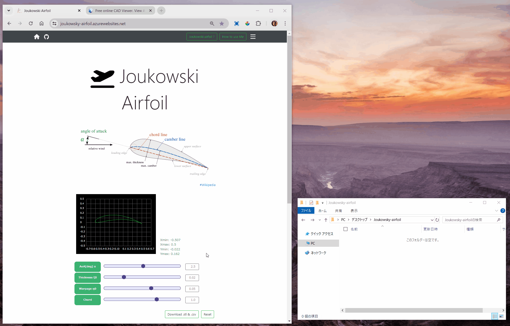

### Introduction

The wing cross section modeler by parameter tuning; AoA, Thickness, Warpage, and Chord.

### Requirements

Google Chrome on a Desktop PC with 'Desktop site' mode preferred.

### Installation

Available now; No more additional installations needed.

### Usage

1. Visit the [main site](https://joukowsky-airfoil.azurewebsites.net/).

2. Tune up each of parameters as you like.

3. Download .stl and .csv file which contains the point cloud about the wing cross section outline.

4. Check the result with the preferred [online 3D viewer](https://sharecad.org/) of yours.

{ width=90% }
 
 